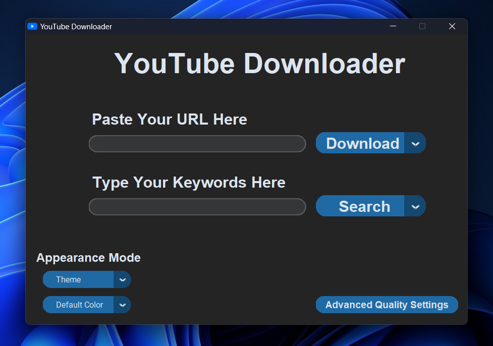
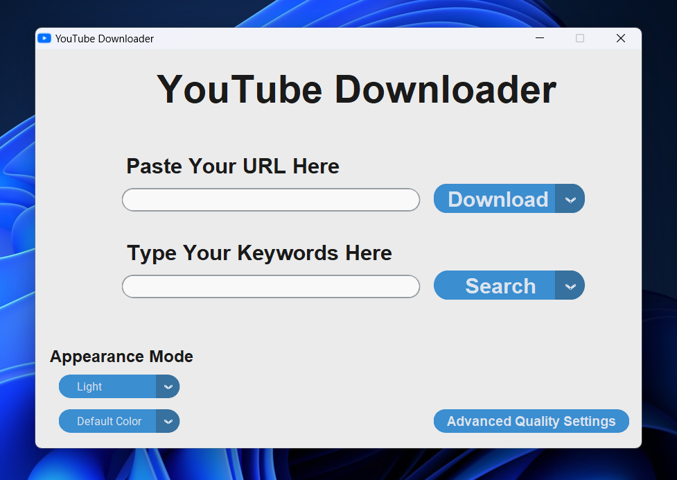
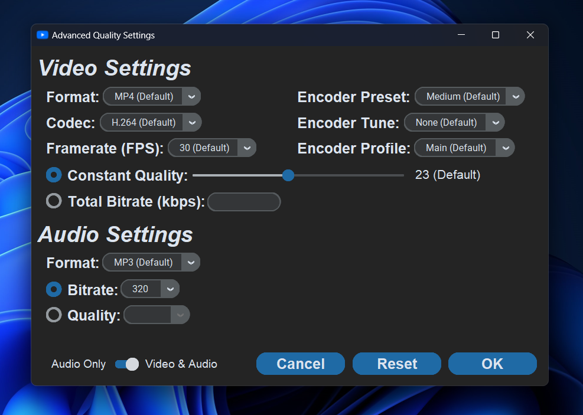
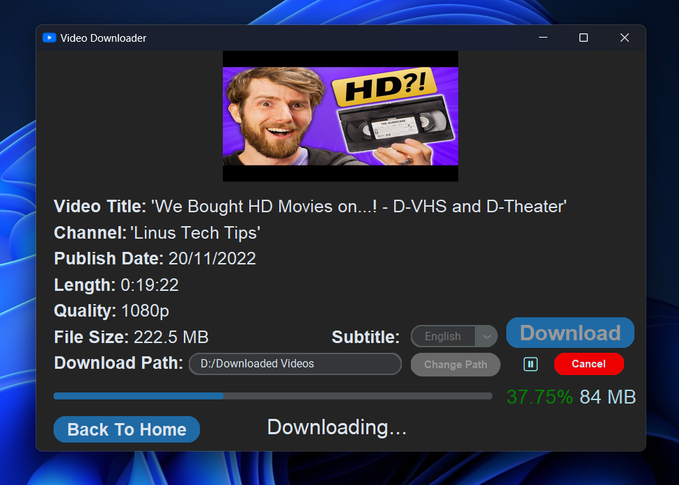
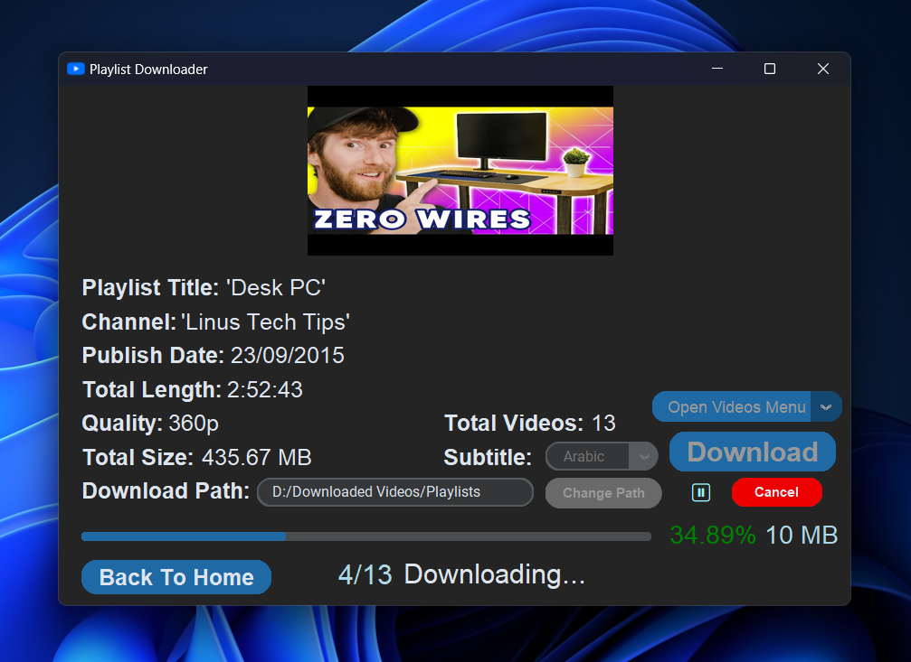
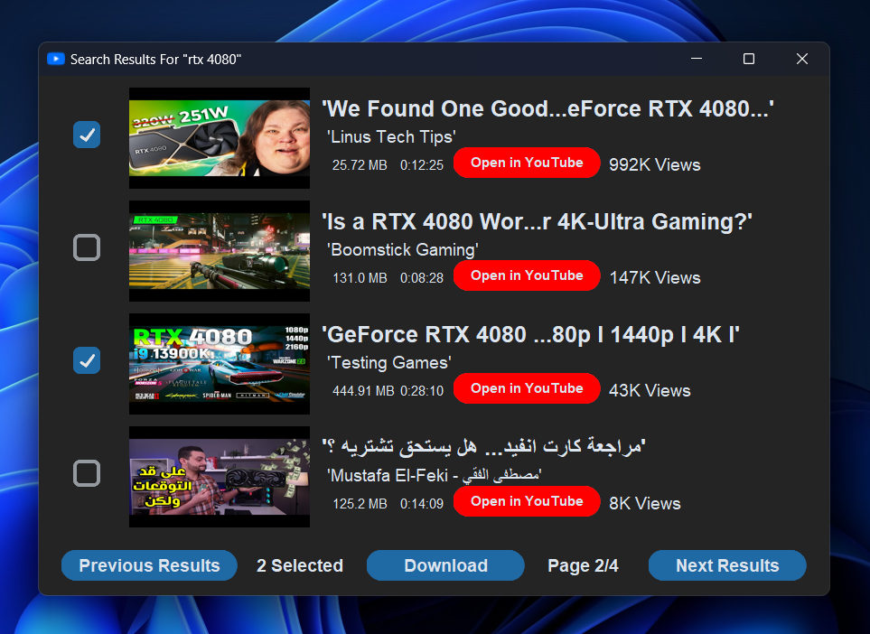
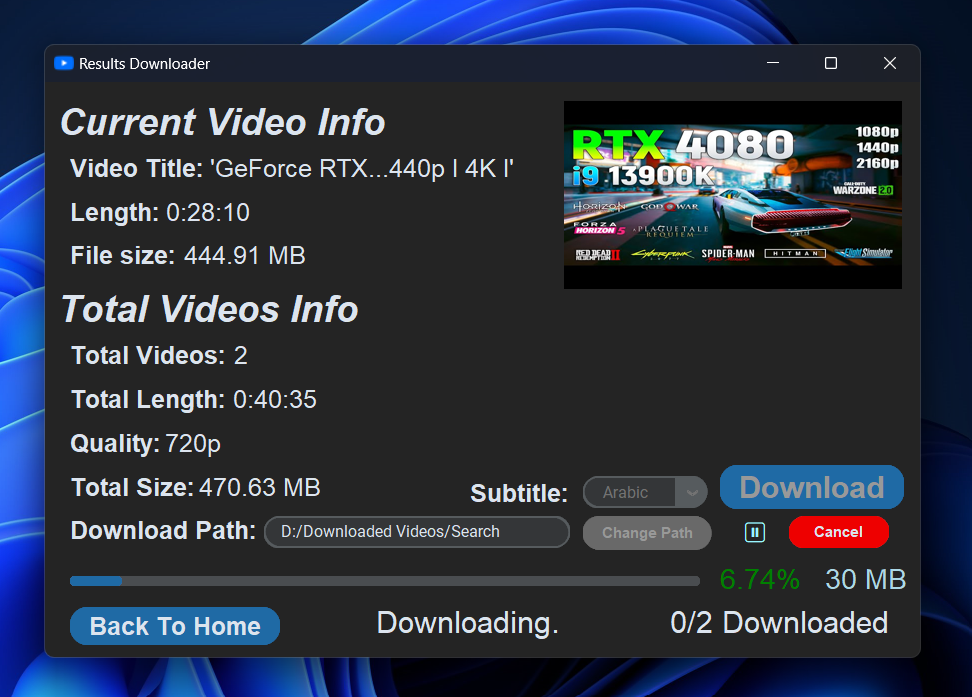

<div align = "center">
</img>
</div>

# **YouTube Downloader**

<!-- for github badges (buttons) https://shields.io/ -->

> **Simple & modern YouTube Downloader to download videos, playlists, subtitles and search queries.**

## Features
<ul>
<li>🔗 Download videos by URL.</li>
<li>🗒️ Download playlists. With an option to select which videos to download.</li>
<li>💬 Download the attached subtitles. Or translate it to your prefered language.</li>
<li>🔎 Search keywords and download videos from the search results.</li>
<li>🔉 Download audio only</li>
<li>🔖 Selectable qualities.</li>
<li>⚙️ Advanced quality settings. (Change format, codec, bitrate, etc...)</li>
<li>🖼️ Download thumbnails.</li>
<li>⏯️ Supports resumability.</li>
<li>📂 Change the download path.</li>
<li>🌄 Simple & modern GUI.</li>
<li>🌃 Customize your theme and default color.</li>
</ul>

## Screenshots
<dl>
<figure>
</img>
<figcaption>| Home Page</figcaption>
</figure>
</dl>

<dl>
<figure>
</img>
<figcaption>| Home Page (Light)</figcaption>
</figure>
</dl>

<dl>
<figure>
</img>
<figcaption>| Advanced Quality Settings Page</figcaption>
</figure>
</dl>

<dl>
<figure>
</img>
<figcaption>| Video Downloader Page</figcaption>
</figure>
</dl>

<dl>
<figure>
</img>
<figcaption>| Playlist Downloader Page</figcaption>
</figure>
</dl>

<dl>
<figure>
</img>
<figcaption>| Search Results Page</figcaption>
</figure>
</dl>

<dl>
<figure>
</img>
<figcaption>| Results Downloader Page</figcaption>
</figure>
</dl>


## Installation Guide
### **For Windows:**
#### **The Easy Way:**
Download the exe from the latest [release](https://github.com/mayman007/YouTube-Downloader/releases).

#### **Build From Source:**

<ol>
<li>Install <a href = "https://www.python.org/downloads/">python</a> and <a href = "https://git-scm.com/downloads">git</a> and add them to the path</li>

<li>Download <a href = "https://www.ffmpeg.org/download.html#build-windows">ffmpeg</a> and add it to the path or put ffmpeg.exe in the same folder as the script</li>

<li>Git-clone this repo & change directory</li>

```
git clone https://github.com/Shinobi7k/YouTube-Downloader.git

cd YouTube-Downloader
```
<li>Install modules using pip</li>

```
pip install -r requirements.txt
```
<li>Run the .py file!</li>

```
py main.py
```
</ol>

### **For Linux:**
#### **The Easy Way:**
Download the binary for linux from the latest [release](https://github.com/mayman007/YouTube-Downloader/releases) and install [ffmpeg](https://www.ffmpeg.org/download.html#build-linux) (`sudo apt install ffmpeg` if you're on a Debian-Based distro)

#### **Build From Source:**
<ol>
<li>Install the following packages:

<ul>
<li> For Debian-Based distros (Debian, Ubuntu, Mint, etc)

```
apt install python3 -y
apt install python3-pip -y
sudo apt-get install python3-tk
sudo apt install git-all
sudo apt install ffmpeg
```
</li>
<li> <p>For other distros</p>
Figure it out yourself.
</li>
</ul>

</li>
<li>Git-clone this repo & change directory

```
git clone https://github.com/Shinobi7k/YouTube-Downloader.git

cd YouTube-Downloader
```
</li>
<li>
Install modules using pip

```
pip install -r requirements.txt
```
</li>
<li>
Run the .py file!

```
python3 main.py
```
</li>
</ol>

## Support

Have questions, feedback, or issues? open an [issue](https://github.com/mayman007/YouTube-Downloader/issues)