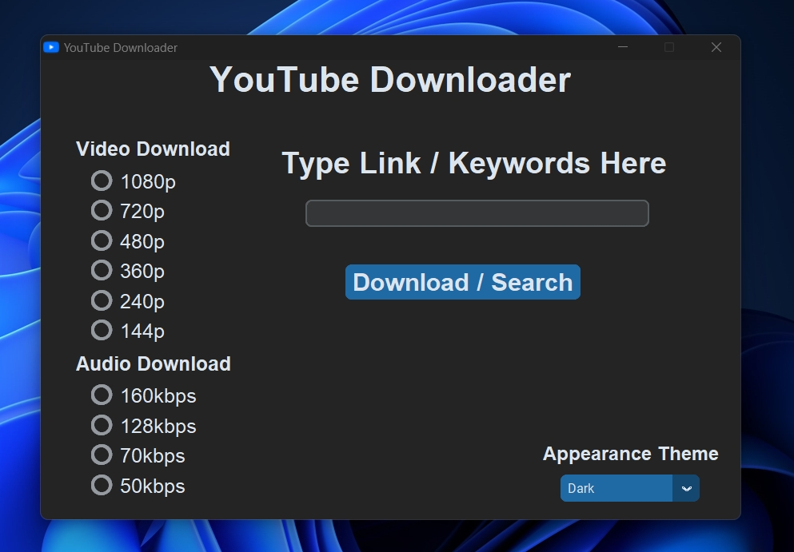
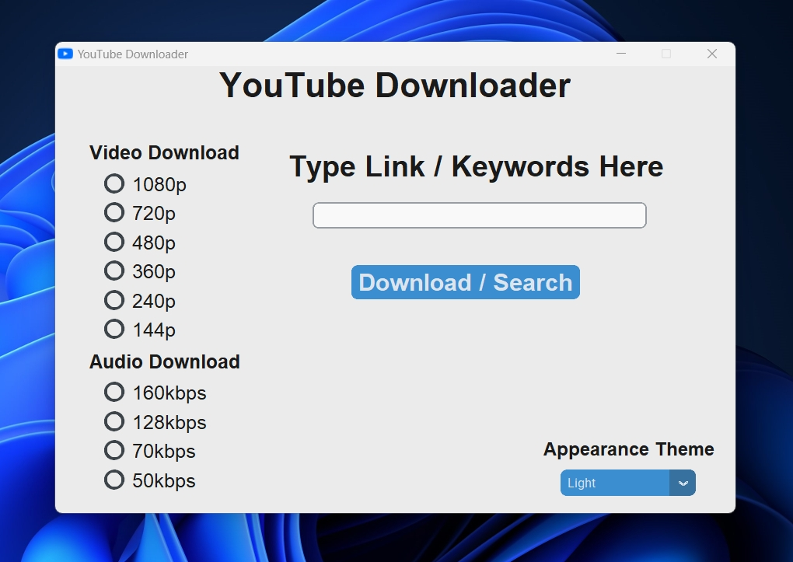
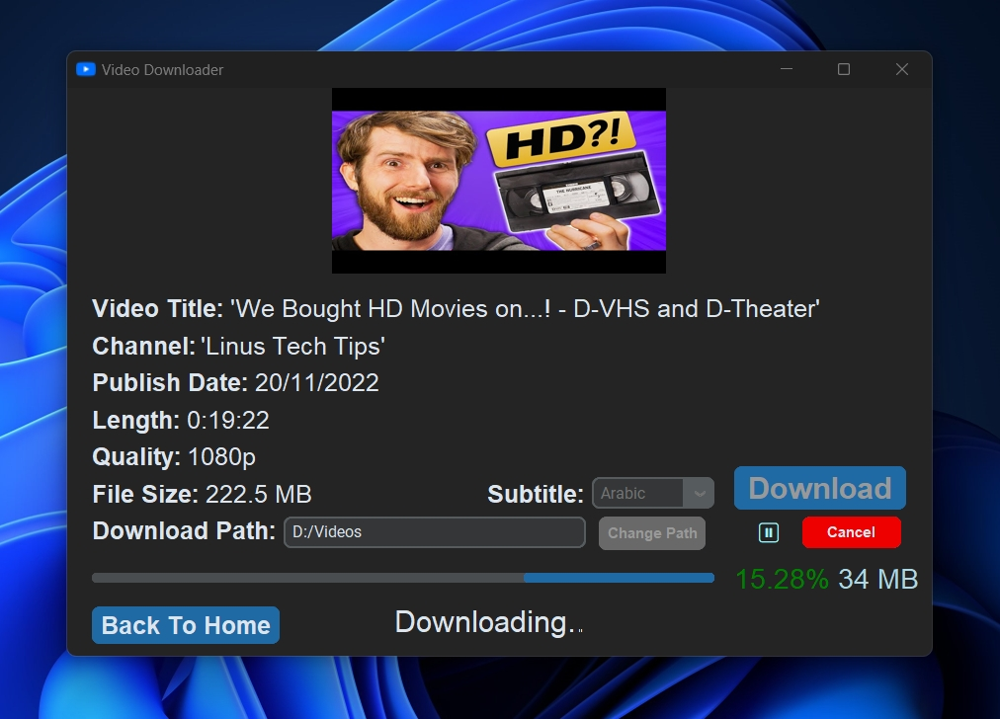
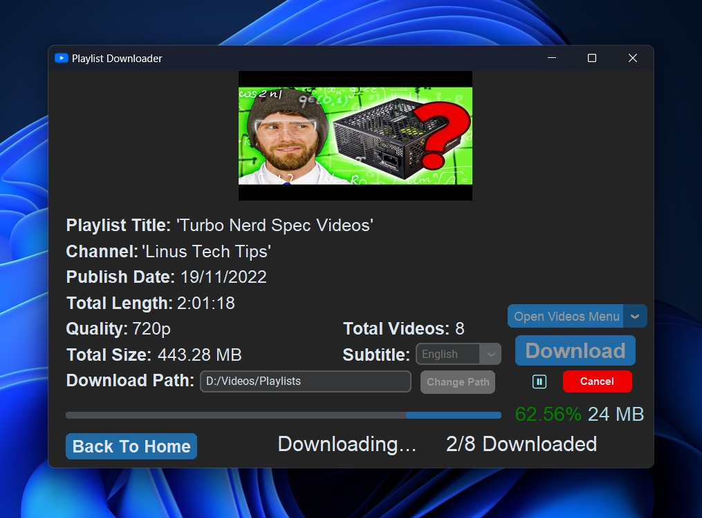
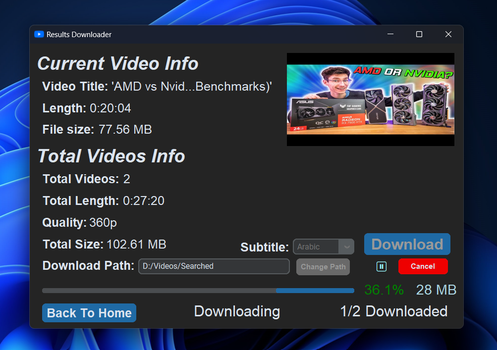

<div align="center">
</img>
</div>
<h1><b>YouTube Downloader</b></h1>
<!-- for github badges (buttons) https://shields.io/ -->

> <p><b>Simple & modern YouTube Downloader to download videos, playlists, subtitles and search queries.</p></b>

<dl>
<dt><h2>Features</h2></dt>
<dd>
<ul>
<li>🔗 Download videos by URL.</li>
<li>🔎 Download videos by search query.</li>
<li>🗒️ Download playlists. With an option to select which videos to download.</li>
<li>💬 Download the attached subtitles. Or translate it to your prefered language.</li>
<li>🔖 Selectable qualities and formats.</li>
<li>▶️ Supports resumabilty.</li>
<li>🖼️ Simple & modern GUI.</li>
<li>🌃 Change your theme dynamically.</li>
</ul>
</dd>
</dl>

<dl>
<dt><h2>Screenshots</h2></dt>
<dd>
</img>
<p>| Home Page</p>
</dd>
<dd>
</img>
<p>| Home Page (Light)</p>
</dd>
<dd>
</img>
<p>| Video Downloader Page</p>
</dd>
<dd>
</img>
<p>| Playlist Downloader Page</p>
</dd>
<dd>
</img>
<p>| Search Results Page</p>
</dd>
<dd>
</img>
<p>| Results Downloader Page</p>
</dd>
</dl>

<dl>
<dt><h2>Installation Guide</h2></dt>
<dd>
<p>0. First, install <a href = "https://www.python.org/downloads/">python</a> and <a href = "https://git-scm.com/downloads">git</a> and add them to the path</p>
<ol>
<li>Git-clone this repo & change directory</li>

```git clone https://github.com/Shinobi7k/YouTube-Downloader.git```
<br>
```cd YouTube-Downloader```

<li>Install modules using pip</li>

```pip install -r requirements.txt```

<li>Make sure that you have <a href = "https://ffmpeg.org/download.html">ffmpeg</a> in the path. or just put ffmpeg.exe in the same folder as the script</li>

<li>Run the .py file!</li>

```py main.py```
</ol>
</dd>
</dl>

<dl>
<dt><h2>Known Problems</h2></dt>
<dd>
<p>Due to pytube's limitations, you may face the following problems:</p>
<ul>
<li>Can't download videos that have more than 30 fps</li>
<li>It will throw an error when loading some random videos</li>
</ul>
</dd>
</dl>
